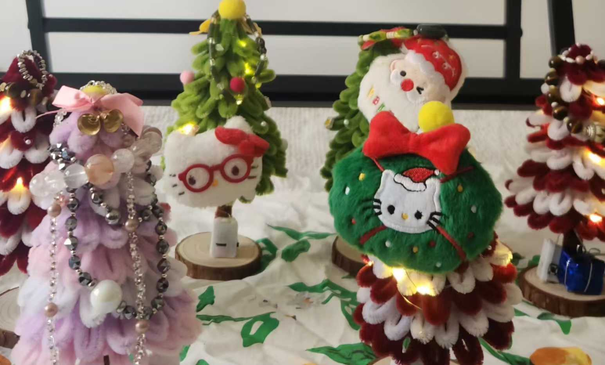
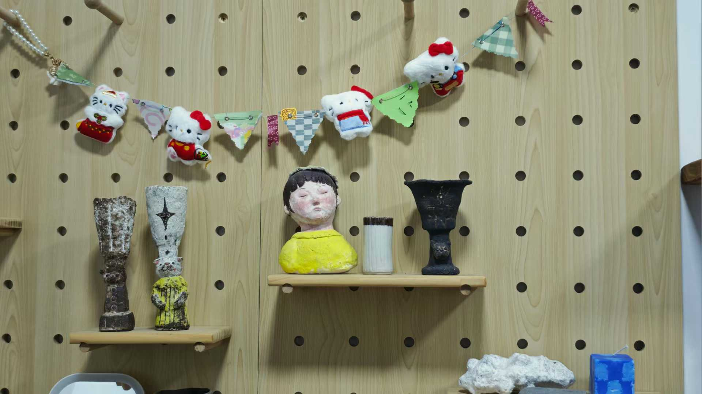

小时候对新年的概念被切割为两个，一个是遵循农历的家人团聚祝贺大会，一个是朋友们依照氛围的同学录互换典礼。
因为后者完全不在家长的管辖范围内，所以当我把路边文具店打包的平安果买给朋友的时候，就好像在说“嘿，虽然我家年夜饭没叫你，但是我欣赏你哦！”
这种来往就算是受商家制造的消费习惯驱使，实际上也的确是个为友谊添柴的好机会🤔🤔

今年我做了一些圣诞树一些彩旗，已经全部打包寄到朋友们家里了。也许会年年有今朝，年年都不同

(class:'small')

几颗扭扭棒圣诞树

(class:'small')

手作小彩旗

(class:'small')

送到朋友家的圣诞树

