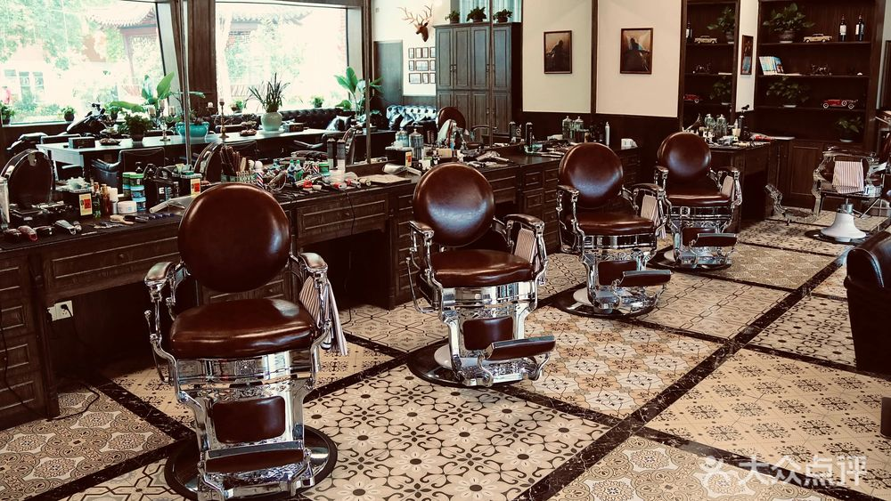

## 商业里的性别

曾经，有一种只给男人理发的理发店，叫barbershop。

说曾经是因为来历久远，不是因为现在没有，如今这种理发店仍然开得起劲，只不过如今的barber不像曾经那么回事。

(class:'large')

四五线小县城也有

其实现代商业逻辑中根据服务类型来区分目标客群非常正常。 

那些男人之所以来挑衅“限女”两个字，是真不明白法治社会，有人这么做完全合法合情合理？

还是不习惯女人作为人，也有拒绝别人的权利呢？

*本文部分灵感来自b站up主“等花鸣”，感谢她产出内容引发思考。*

除了刚刚提到的barbershop；
在我们四川，特别是成都平原19到20世纪的开满各地的茶馆，
也一样发挥着供男人们交换信息拉帮结派的政治功能。

女人不能在闺房穿针引线或承包家务、生养子女的同时，
叫上一群陌生人来家里参与社会讨论。

总之，是没有什么机会参与公共资源流动或成为场域、商业主体的。

这种暴戾的过往本该伴随新中国的成立而泯灭。
过去历史上全男空间对女人的排斥并不是一种鼓励行业创新发展的行为。

而如今的混合空间在部分行业中缺乏个性化的供需链条，导致行业显现巨大的发展空缺。
这些行业需要全女空间的探索，也是好事一件，说明经济还有盼头。

这些道理稍微有点常识就可知。
不懂的男人我相信ta也不是真的不懂，而是不愿意承认新中国的成立，觉得法治社会让自己难受了，不习惯。

有的人发现别人盘子里肉变多，就立刻认为自己的食物被抢夺，却不用自己应激所浪费的努力去开灶添柴。

更何况如今的全女空间跟曾经的全男空间从动机和性质上来看完全不是一种情景，
却这种人被粗糙地混为一谈，以己之心度君子之腹。

## 不同性别差异化需求，旱的旱死涝的涝死

说到底，现在大部分全女空间容纳了女性长期以来得不到满足的差异性需求，所以应当存在，早该存在。

读过生物书不就知道医药行业总是以男性或者雄性小白鼠的身体为标准进行研究、
学过钢琴就知道乐器是以男性的尺寸进行设计、
穿过牛仔裤就知道牛仔裤中间有个只对男人有用的拉链，
男人的世界覆盖美好生活的方方面面。

就连我考救生员的时候，心肺复苏时刻的操作步骤都要求对着男性假人喊“先生先生醒一醒”。

假如遇到需要急救的女人，我们这些被训练过的针对男人进行操作的人需要在脑子里先行思考出一套从未被人教导过的思路。

这些思考和适应生疏状况造成的成本如何强行让被急救的女人买单。

这些从未触摸过女性假人却培训过关的急救人是否能快速把真实情况里的女人衣服解开，手坚定地按到胸口上而不经思索开启AED等下一步操作呢？这个答案我不是很乐观。

## 必然轮到我

现在，我有条件走到这一步参与全女空间的建设，我就做了。

前年我做过几次文化活动，其中大部分时候男女共同参加，
结果不知道怎么的，那几次的男同志总是忍不住吸引女同志的注意，
成功打乱属于我这个主办人的节奏。

于是我收到来自女生们的建议，想专注在没有男人破坏的场域中。

好的，最近几年我发展体育事业了，又遇到类似的情况。女人来我这儿是为了活动本身，如同部分男人去男人主办的活动一样纯粹；

可是男人来女生主办的活动，好像常常掺杂了别的什么心思，我费解，我不解。

很多时候我怀疑自己是不是在让渡公共话语空间。

建设全女空间这件事动机上到底是逃避、省事，还是真心为女人着想？
我可能不纯粹，多少沾点私心吧。

我这个人怕难，怕麻烦，能懒一点是一点，我可不想被人施加情感协调者的伟大义务。

我教游泳，我就要教符合妇科生理机制的运动模式，
我就要教雌激素孕激素对人的影响，
我就要教女人各种运用身体的感受方法。

多样的渠道引领多元的评价系统。

我说，有些小气鬼可赶紧盯着自己的饭碗刨两口吧，别扒拉别人的碗了，自己有米没米自己还不清楚嘛。

